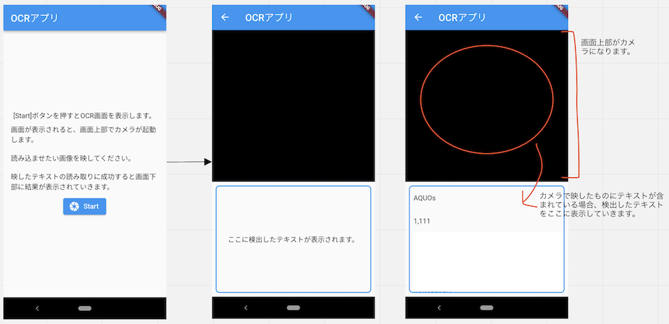

# ocr_sample_app
Google ML Kitの`Text Recognition`を使用して、オンデバイスでカメラに映した画像からテキストをリアルタイムに抽出し画面に表示するサンプルアプリです。  
`Text Recognition`で摘出したテキストはBlock->Lineと分解できますが、このアプリはサンプルなので見やすいようBlockの先頭だけ画面下部に流しています。  

## 画面イメージ

## 参考
コードを書くにあたって参考にしたリポジトリです。
- Google's ML Kit for Flutter
  - Text Recognitionのサンプルコード
  - https://github.com/bharat-biradar/Google-Ml-Kit-plugin
- Flutter Catalog
  - google_ml_kitのサンプルコード（firebase_mlkit_ex.dartというファイル名ですが中身はGoogleMLKitに移行されていました）
  - https://github.com/X-Wei/flutter_catalog/blob/master/lib/routes